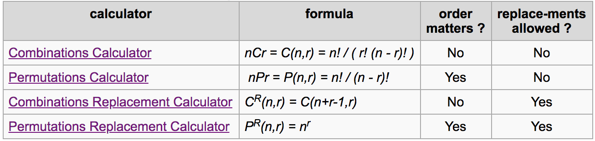

## Practising with Combination and Permutation by generating samples.

  

Check the result: `$ go run .`

### Factorial: !
There are n! ways of arranging n distinct objects into an ordered sequence, permutations where n = r.

### Combination
The number of ways to choose a sample of r elements from a set of n distinct objects where **order does not matter and replacements are not allowed.**

### Permutation
The number of ways to choose a sample of r elements from a set of n distinct objects **where order does matter and replacements are not allowed** . When n = r this reduces to n!, a simple factorial of n.

### Combination Replacement
The number of ways to choose a sample of r elements from a set of n distinct objects **where order does not matter and replacements are allowed**.

### Permutation Replacement
The number of ways to choose a sample of r elements from a set of n distinct objects **where order does matter and replacements are allowed**.

### Other:
*n*: the set or population
*r*: subset of n or sample set